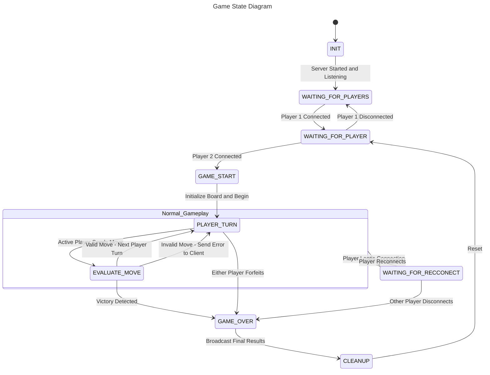

```mermaid
---
config:
    theme: redux_dark
title: Game State Diagram
---
stateDiagram-v2
    [*] --> INIT
    INIT --> WAITING_FOR_PLAYERS : Server Started and Listening
    WAITING_FOR_PLAYERS --> WAITING_FOR_PLAYER : Player 1 Connected
    WAITING_FOR_PLAYER --> WAITING_FOR_PLAYERS : Player 1 Disconnected
    WAITING_FOR_PLAYER --> GAME_START : Player 2 Connected
    GAME_START --> PLAYER_TURN : Initialize Board and Begin

    State Normal_Gameplay{
        PLAYER_TURN --> EVALUATE_MOVE : Active Player Sends Move
        EVALUATE_MOVE --> PLAYER_TURN : Valid Move - Next Player Turn
        EVALUATE_MOVE --> PLAYER_TURN : Invalid Move - Send Error to Client
    }

    EVALUATE_MOVE --> GAME_OVER : Victory Detected
    PLAYER_TURN --> GAME_OVER : Either Player Forfeits
    Normal_Gameplay --> WAITING_FOR_RECCONECT : Player Loses Connection
    WAITING_FOR_RECCONECT --> Normal_Gameplay : Player Reconnects
    WAITING_FOR_RECCONECT --> GAME_OVER : Other Player Disconnects
    GAME_OVER --> CLEANUP : Broadcast Final Results
    CLEANUP --> WAITING_FOR_PLAYER : Reset
```