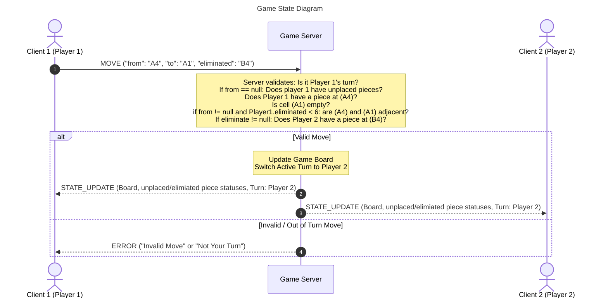

```mermaid
---
config:
    theme: redux_dark
title: Game State Diagram
---
sequenceDiagram
    autonumber
    actor Client1 as Client 1 (Player 1)
    participant Server as Game Server
    actor Client2 as Client 2 (Player 2)


        Client1->>Server: MOVE ("from": "A4", "to": "A1", "eliminated": "B4")
    Note over Server: Server validates: Is it Player 1's turn?<br>If from == null: Does player 1 have unplaced pieces?<br>Does Player 1 have a piece at (A4)?<br>Is cell (A1) empty?<br>if from != null and Player1.eliminated < 6: are (A4) and (A1) adjacent?<br>If eliminate != null: Does Player 2 have a piece at (B4)?
    alt Valid Move
        Note over Server: Update Game Board<br>Switch Active Turn to Player 2
        Server-->>Client1: STATE_UPDATE (Board, unplaced/elimiated piece statuses, Turn: Player 2)
        Server-->>Client2: STATE_UPDATE (Board, unplaced/elimiated piece statuses, Turn: Player 2)
    else Invalid / Out of Turn Move
        Server-->>Client1: ERROR ("Invalid Move" or "Not Your Turn")
    end

```